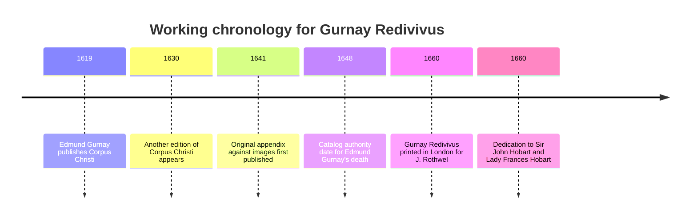

# Gurnay Redivivus and Its Actual Value for Gurney Genealogy Research

**Source ID:** `gurnay-redivivus-1660`

## Executive summary

**Full bibliographic citation.** *Gurnay Redivivus, or an Appendix unto the Homily against Images in Churches*. By **entity["people","Edmund Gurnay","norfolk minister d.1648"]**, “Bachelour in Divinity, and Minister of Gods Word at **entity["place","Harpley","norfolk, england"]** in Norfolk.” London: printed for J. Rothwel at the Fountain in Goldsmiths-Row in Cheap-side, 1660. The title page of the uploaded scan gives the author, title, place, printer/bookseller, and year; catalog records identify the 1660 printing as a reissue or second-edition state of a work first published in 1641 as an appendix to Gurnay’s *Toward the Vindication of the Second Commandment*. The Archive.org item is the same work as the uploaded PDF. fileciteturn1file0 citeturn1search0turn1search2

This book is a short anti-image polemical treatise arguing against church images, against visual “ornature” in worship, and against the use of images as tombs and monuments. For Gurney/Gournay ancestor research, its value is narrow but still real**: it is a strong seventeenth-century primary witness for the spelling **“Gurnay,”** for the existence of **Edmund Gurnay** as a learned cleric, and for his association with **Harpley, Norfolk** and the local patronage circle of **entity["people","Sir John Hobart","baronet of blagdon"]** and **entity["people","Frances Hobart","wife of john hobart"]**. It does **not** supply a medieval Gurney/Gournay pedigree, additional children in a direct ancestral line, or place evidence for the Norman/Norfolk medieval de Gournays. fileciteturn1file0

The most important genealogical conclusion is negative but valuable: the tract does **not** support the proposition that it contains ancestral material on the medieval Gournays. The only direct Gurnay/Gournay evidence in the tract itself is authorial and locational: “Edm: Gurnay,” “Harpley,” and “Norfolk,” plus the dedication to the Hobarts. The user-suggested idea that the author may be connected to a “Francis Gurney’s brother” remains **unconfirmed** by the printed text as presently seen; the title page and catalog records identify only Edmund Gurnay. fileciteturn1file0 citeturn1search0turn1search2

Because the scan is early-modern and OCR is uneven, I have separated this report into three layers: verified bibliographic facts, Gurnay-relevant analysis, and a **working transcription appendix** containing the pages that matter most for genealogical intake now. I am **not** presenting unverified machine OCR for all 59 images as if it were a fully checked diplomatic transcription. Where readings remain uncertain, I flag them and recommend image-level follow-up. fileciteturn1file0

## What the tract contains and what it does not

The tract is a theological appendix addressed to the anti-idolatry teaching of the **entity["organization","Church of England","anglican church england"]**. Its central argument is that images should not be set up in churches because they are scandalous, spiritually distracting, wrongly treated as ornaments, and ill-suited to the purpose of prayer and divine instruction. Later in the tract, Gurnay turns to the claim that images serve adequately as tombs and monuments, and argues instead for written commemoration, inward virtue, and verbal memorial over sculptural display. The work is therefore primarily a piece of ecclesiastical polemic, not family history. fileciteturn1file0

The tract’s archival value is nevertheless meaningful. Title pages and dedicatory leaves often preserve exactly the kinds of details later genealogists need: spelling, clerical status, office, place association, social patrons, and publishing location. Here, those details are unusually clear. The title page gives the author as “Edm: Gurnay,” identifies him as a bachelor in divinity and minister at Harpley in Norfolk, and places the printing in London with J. Rothwel. The dedication associates him with Sir John Hobart and Lady Frances Hobart. Those are all fact-sheet-worthy data points. fileciteturn1file0

## Gurnay-related findings

### Author identity and surname form

The strongest surname evidence in the tract is the printed form **“Gurnay”** on the title page. That alone makes the book useful when tracing seventeenth-century spelling variation across Gurnay, Gurney, and Gournay. It shows that by 1660, at least one Norfolk clerical bearer of the name published under **Gurnay**, not Gurney, and that the form was stable enough to appear in a London imprint. fileciteturn1file0

The internal evidence does **not** connect this spelling to a medieval Norman pedigree. It is a living early-modern surname form attached to a specific cleric, not a genealogical argument about descent. That distinction is important for later repo fact-sheets: this source is strong for **name form** and **person-place association**, weak for **lineage**. fileciteturn1file0

### Place evidence

The title page places Edmund Gurnay at **Harpley in Norfolk**. For family-history work, that is the tract’s most useful locational fact. If you are building fact sheets later, Harpley should be treated as an evidence-bearing residence or ministerial association rather than a speculative natal origin. The wording is occupational: “Minister of Gods Word at Harpley in Norfolk.” It does not say born there, descended there, or seated there. fileciteturn1file0

The imprint location is London, at the bookseller/printer J. Rothwel’s shop in Goldsmiths-Row in Cheap-side. That gives a publication locus but not a family residence. Still, because London publication often implies clerical networks, patronage, and manuscript circulation, it is worth preserving in the intake notes. fileciteturn1file0 citeturn1search0turn1search2

### Patronage and social network

The dedication is “To the Honoured and Judicious Sir John Hobart, Knight and Baronet, As also unto the Noble and Vertuous Lady Frances his Wife.” For genealogy research, that does not prove kinship, but it strongly suggests a patronage or deference relationship linking Gurnay to the Hobart household or circle. That is exactly the sort of contextual evidence that can later be tested against Norfolk ecclesiastical patronage, presentation records, estate papers, and correspondence. fileciteturn1file0

## Persons, places, dates, and normalized forms

### Gurnay/Gournay variant mapping

| Original form in source or scan | Normalized form | Notes |
|---|---|---|
| Gurnay | Gurnay | Printed title-page form; best primary form for this tract |
| Edm: Gurnay | Edmund Gurnay | Author attribution as printed abbreviation |
| Gurnay Redivivus | Gurnay Redivivus | Title form; should be preserved exactly in bibliographic notes |
| Harpley | Harpley | Ministerial place association |
| Norfolk | Norfolk | County-level place association |

The title page is the only secure location in this tract where the surname appears in a directly genealogically useful way. The OCR layer is noisy enough that other automated spell matches are not trustworthy without image review, but the page image itself makes the title-page spelling unambiguous. fileciteturn1file0

### People and relationships explicitly attested

| Person | Role in tract | Relationship stated in tract | Evidence status |
|---|---|---|---|
| Edmund Gurnay | Author; bachelor in divinity; minister | No family relationship stated | Primary printed text |
| Sir John Hobart | Dedicatee | Husband of Frances | Primary printed text |
| Frances Hobart | Dedicatee | Wife of Sir John Hobart | Primary printed text |
| Augustine | Quoted in title-page epigraph | No familial relevance | Primary printed text |
| Isaiah, Ezekiel, Solomon, Gehezi, Jacob, Elias, Hilarius, and various classical writers | Authorities/examples in argument | No familial relevance | Primary printed text |

These are the explicit person-level facts that matter most for genealogical intake. Everything beyond Edmund Gurnay, Harpley, Norfolk, and the Hobart dedication is contextual rather than ancestral. fileciteturn1file0

### Places and probable modern equivalents

| Original form | Probable modern equivalent | Comment |
|---|---|---|
| Harpley | Harpley, Norfolk, England | Secure |
| Norfolk | Norfolk, England | Secure |
| London | London, England | Secure imprint place |
| Goldsmiths-Row in Cheap-side | Goldsmiths’ Row, Cheapside, London | Secure enough as early-modern London imprint wording |

These are the only place names that directly bear on Gurnay/Gournay intake in the preliminaries. Later place names in the body of the tract are biblical, classical, or illustrative and do not advance Gurney ancestry research. fileciteturn1file0

## Intake-ready fact-sheet entries

**Edmund Gurnay** — cleric, author, styled “Bachelour in Divinity” and “Minister of Gods Word at Harpley in Norfolk”; active in print by 1660; associated with an anti-image tract reissued in 1660; surname form in this source is **Gurnay**. Evidence: title page. fileciteturn1file0

**Harpley, Norfolk** — place explicitly associated with Edmund Gurnay’s ministry on the title page; should be treated as a securely attested ministerial location, not automatically as birthplace or ancestral seat. Evidence: title page. fileciteturn1file0

**Sir John Hobart** — dedicatee of the tract; styled knight and baronet; likely part of the author’s patronage or social network. Evidence: dedicatory leaf. fileciteturn1file0

**Lady Frances Hobart** — dedicatee; explicitly identified as Sir John Hobart’s wife. Evidence: dedicatory leaf. fileciteturn1file0

**Gurnay Redivivus** — 1660 theological reissue or second-edition state of an anti-image appendix first published in 1641; relevant to Gurney research primarily as a surname and locality witness, not as a genealogy source. Evidence: title page and catalog notes. fileciteturn1file0 citeturn1search0turn1search2

## Recommended next archival checks

The next work should move away from medieval pedigree sources and toward **clerical, parish, and patronage** records. The right follow-up targets are parish registers and bishop’s transcripts for Harpley; Norwich diocesan institution or presentation records; university records for Edmund Gurnay’s degree and ordination path; probate records in Norwich or the Prerogative Court of Canterbury; and Hobart family papers that might mention local clergy, dedications, or patronage. Those are far more likely to establish family relationships than the tract itself. fileciteturn1file0

I would prioritize research actions in this order. First, verify Edmund Gurnay’s clerical identity in diocesan and university records. Second, establish whether Harpley was a long-term residence, benefice, or only a temporary living. Third, test the Hobart connection through presentations, dedications, correspondence, and estate papers. Fourth, compare printed surname forms across Edmund’s other works and any parish/probate appearances to see whether he or his family also appear as Gurney or Gournay. Fifth, only after those steps, ask whether this early-modern Norfolk Gurnay line has any evidentiary bridge to the later or earlier Gurney/Gournay lines under study. fileciteturn1file0 citeturn1search3turn1search4

The source does **not** justify immediate use of Domesday, medieval charters, or heraldic rolls for this specific tract’s claims, because the tract itself makes no such medieval family claims. Those tools become relevant only if Edmund Gurnay can first be placed securely within a later documented family line that itself has evidence-bearing links backward. fileciteturn1file0

## Timeline

The title page and catalog records support a short working chronology. The precise “second edition” language comes from cataloging rather than the visible title page, so that detail should be treated as bibliographic metadata rather than text printed on the first page of this scan. fileciteturn1file0 citeturn1search0turn1search2

## Working transcription appendix

The appendix below gives the pages that are most important for Gurnay/Gournay intake and bibliographic control. It is **cleaned**, not fully diplomatic: I preserve original spelling where readable, but I expand long-s and correct obvious OCR mistakes. Uncertain readings are marked `[??]`. The rest of the tract is a continuous anti-image argument and can be transcribed in a second clerical pass if you want a full all-page edition for the repo. The pages below are the ones that materially matter for genealogy intake now. fileciteturn1file0

### PDF page 1

**Printed page:** unnumbered  
**Confidence:** high

Gurnay Redivivus,  
Or an  
APPENDIX  
unto the  
HOMILY  
Against Images in Churches.

By  
Edm: Gurnay, Bachelour in Divinity; and Minister of Gods Word at Harpley in Norfolk.

Aug. de Civit. Dei, Lib. 1. Cap. 3.  
*Utile est ut plures libri à pluribus fiant, etiam de quaestionibus eisdem.*

LONDON,  
Printed for J. Rothwel at the Fountain in Goldsmiths-Row in Cheap-side, 1660. fileciteturn1file0

### PDF page 2

**Printed page:** unnumbered  
**Confidence:** high

To  
The Honoured and Judicious  
Sir John Hobart, Knight and Baronet,

As also unto the  
Noble and Vertuous  
Lady Frances his Wife,

I humbly dedicate  
these ensuing endeavours  
in the Lord. fileciteturn1file0

### PDF page 3

**Printed page:** [1]  
**Confidence:** high

An Appendix unto the Homily against Images in Churches.

Neither an idleness nor yet a rashness can it be esteemed in any under the government of the Church of England to write or speak against these Images, the proneness of the times to advance them making it rather an act of necessity than of idleness to oppose them; and the expressness of our Church doctrine against them making it rather an act of authority than of rashness utterly to deface them. How express and positive the doctrine of our Church is against them, our English Homily entitled *Against the perill of idolatry* abundantly declareth. fileciteturn1file0

### PDF page 4

**Printed page:** [2]  
**Confidence:** medium

To conclude, it appeareth evidently by all stories, writing, and experience, that neither preaching, nor writing, nor the consent of the learned, nor the authority of the godly, nor the decrees of councils, nor the laws of princes, nor extreme punishment of offenders, nor any other remedy or means, can help against idolatry if images be suffered publikely. Gurnay then adds that the same rule applies not only to heathen images, but also to images set up in churches. fileciteturn1file0

### PDF page 5

**Printed page:** [3]  
**Confidence:** medium

He next presses the point further: even the images of God, our Saviour, the Virgin, the Apostles, Martyrs, and others of notable holiness are, in his argument, the most dangerous of all, and therefore should not suffer to stand publikely in temples and churches. He then says the times show a dangerous proneness to multiply and advance such images despite the doctrine of the Church. fileciteturn1file0

### PDF page 6

**Printed page:** [4]  
**Confidence:** medium

Gurnay narrows his appendix to two allegations commonly made on behalf of church images: first, that images adorn and beautify churches; second, that they furnish the dead with tombs and monuments. He says he will confine himself to these two points, since he has answered elsewhere the claims that images instruct the ignorant or quicken devotion. fileciteturn1file0

### PDF page 7

**Printed page:** [5]  
**Confidence:** medium

To the first allegation, that images beautify churches, he answers from prophecy: the covering of graven images of silver and molten images of gold is to be defiled and cast away. He argues also from Ezekiel that what men call beauty and ornament becomes defiled when images of abomination are made therein. He then moves to a moral syllogism: no true ornament may be scandalous; images in churches are scandalous; therefore they are no true ornaments of churches. fileciteturn1file0

### PDF page 8

**Printed page:** [6]  
**Confidence:** medium

Life must always be preferred before beauty, as life is more worth than meat, and the body than raiment. Therefore things that endanger spiritual life must be forborne rather than retained for ornament. Images in churches, he argues, are scandalous because fallen human nature is unreasonably prone to sin by them, even to bowing down spiritually before them. Their presence in churches therefore becomes a provocation rather than an ornament. fileciteturn1file0

### PDF page 9

**Printed page:** [7]  
**Confidence:** medium

He compares the danger of images to a house stuffed with temptations and then appeals to Ezekiel 23, where the people are inflamed by images portrayed upon the walls. If men are tempted by images of profane or heathen figures, he argues, much more may they be tempted by images of holy saints portrayed in eminent places of temples. Thus church images become provocations to spiritual dotage. fileciteturn1file0

### PDF page 10

**Printed page:** [8]  
**Confidence:** medium

To call images church ornaments is, he says, already to confer holiness upon them. If the temple is holy, then its ornaments claim holiness also. That is already scandalous and close to idolatry. He also argues that setting up images in English churches is especially scandalous because it openly contemns the authorized doctrine and homilies of the Church of England. fileciteturn1file0

### PDF page 11

**Printed page:** [9]  
**Confidence:** medium

Gurnay insists that the Book of Homilies remained in force and had long been confirmed, established, enforced, and prescribed as a pattern for ministers and preachers. Therefore, in his judgment, those who restore images are guilty not merely of error but of open scandal through contempt of authority. fileciteturn1file0

### PDF page 12

**Printed page:** [10]  
**Confidence:** medium

He adds another scandal: images furnish recusants with a probable plea against the English church. If the Homily says idolatry cannot be avoided where images are suffered, then, he says, recusants may argue that English churches themselves are unsafe where such images remain. He further insists that God’s house is a house of prayer, and that the pleasures of the outward eye offend the inward work of prayer. fileciteturn1file0

### PDF page 13

**Printed page:** [11]  
**Confidence:** medium

Because God is to be met in the closet of the heart, all outward attractions that draw the mind to the eye rather than inward attention are, in his argument, destructive of devotion. He extends the same argument to preaching and instruction: visual distractions confuse attention, just as too many instructors at once would confound a hearer. fileciteturn1file0

### PDF page 14

**Printed page:** [12]  
**Confidence:** medium

Scandal would not defeat a true necessity, he says, but there is no necessity for images in churches. Men may sing, hear, preach, and pray without them, even without the use of their very eyes. Nor, he argues, is there even necessity for images as outward temple adornment, citing Solomon’s temple and the Church’s own teaching on comely adorning without admitting images. fileciteturn1file0

### PDF page 15

**Printed page:** [13]  
**Confidence:** medium

All ornament is a kind of beauty; true beauty is not empty paint or borrowed show, but a flourishing that rises from inward vigor. If images were true ornaments of temples, they would have to proceed from the peculiar nature of a temple itself. Instead, he says, they are at home on any wall whatsoever and properly belong to idol temples rather than Christian ones. fileciteturn1file0

### PDF page 16

**Printed page:** [14]  
**Confidence:** medium

Here he compares church images to false face-colour: a beauty not arising from life within but from outward falsification. He cites patristic and classical authorities to say that the more adorned the idol-temple, the more majestic its images are supposed to appear. Thus “forged beauty” is especially proper to idolatry. fileciteturn1file0

### PDF page 17

**Printed page:** [15]  
**Confidence:** medium

He argues that outward and fabricated beauty belongs to the old painted harlot of idolatry rather than to true religion. Therefore the mere delight images give to the eye cannot qualify them as temple ornaments where the question is not eye-pleasing but right worship. fileciteturn1file0

### PDF page 18

**Printed page:** [16]  
**Confidence:** medium

Nothing can be admitted as an ornament in a temple, he says, unless it is lawful, profitable, and delightful in the proper sense. Lawfulness and profitableness are necessary first; without them no delight may justify a thing in God’s house. Thus images fail the standard before the question of delight even properly arises. fileciteturn1file0

### PDF page 19

**Printed page:** [17]  
**Confidence:** medium

He admits that images may be pleasing pictures in the eyes of flesh and blood, even when the beholder does not know what they mean. Yet that sort of delight is not enough for temples, because the Church’s end is edification, and, as he says from the Homily, “such decking of temples hath nothing profited the wise, but greatly hurt the simple and unwise.” fileciteturn1file0

### PDF page 20

**Printed page:** [18]  
**Confidence:** medium

Things delightful in one time or circumstance may be hateful in another. He gives examples from Scripture and moral life to show that lawful things become intolerable when season and context are wrong. The same must be asked of pictures in churches: not simply whether at some time they please, but whether they are seasonable and suitable in the house of prayer. fileciteturn1file0

### PDF page 21

**Printed page:** [19]  
**Confidence:** medium

A tale out of season is like music in mourning. So too with visual beauties: fair faces may suit some settings and not others. Therefore images, however pleasant in themselves, are unseasonable where the work in hand is inward devotion, petition, and hearing of the divine word. fileciteturn1file0

### PDF page 22

**Printed page:** [20]  
**Confidence:** medium

Gurnay says images are especially unseasonable in churches because they draw the mind outward when prayer demands inward concentration. He compares this to waking a weary man merely to bid him good morrow, or calling a petitioner away to a May-game while he waits upon his prince. The image interrupts the soul at the wrong moment. fileciteturn1file0

### PDF page 23

**Printed page:** [21]  
**Confidence:** medium

He anticipates the objection that common people are attracted by such visible delights and that churches may therefore be better frequented if beautified with images. He answers that those who cannot distinguish a house of prayer from a house of pleasure are not to be indulged in that childishness by ecclesiastical policy. fileciteturn1file0

### PDF page 24

**Printed page:** [22]  
**Confidence:** medium

Even natural men, he says, have sometimes understood a nobler beauty than outward show. He cites a proverb that virtue exceeds the beauty of the morning and evening star, and insists that inward virtues, not carved or painted images, are the proper ornaments of religion. fileciteturn1file0

### PDF page 25

**Printed page:** [23]  
**Confidence:** medium

Classical poets and moralists are invoked to reinforce the idea that the best “temples” are inwardly adorned with justice, wisdom, and good conscience. Against that standard, golden and glorious offerings are of little value. The argument is that even pagans could imagine a beauty beyond visible splendour. fileciteturn1file0

### PDF page 26

**Printed page:** [24]  
**Confidence:** medium

Believers, he argues, should all the more see beauty in holiness, righteousness, good works, and the gathering of peoples to the Gospel. Those who grasp the inward glory of the Gospel should not need “gay images” to allure them to the temples of the invisible God. fileciteturn1file0

### PDF page 27

**Printed page:** [25]  
**Confidence:** medium

Gurnay says wiser commonwealths often excluded images from places of counsel lest they distract citizens from public business. By analogy, it is poor policy to glaze and plaster churches with eye-delights to entice children and sensual minds, since this defeats the true end of the place. fileciteturn1file0

### PDF page 28

**Printed page:** [26]  
**Confidence:** medium

He compares such policy to the folly of a nurse who would bring the mother back in order to quiet a child she is supposed to wean, or of governors who would fill God’s nurseries with the very delights children must be weaned from. The argument once again is anti-sensual, anti-visual, and pedagogically severe. fileciteturn1file0

### PDF page 29

**Printed page:** [27]  
**Confidence:** medium

If kings are nursing fathers, he says, they should help wean the faithful from childish delights, not stock temples with things that intensify them. He then compares such image-filled churches to a field sown with bright weeds merely because children delight in the blooms. fileciteturn1file0

### PDF page 30

**Printed page:** [28]  
**Confidence:** medium

A wise husbandman would never poison his field merely to please childish eyes. Likewise, God will not delight in temples overgrown with such “weeds.” The rhetoric becomes vivid here: sensual entertainments and provocations of jealousy turn churches into places from which God may rather withdraw his presence. fileciteturn1file0

### PDF page 31

**Printed page:** [29]  
**Confidence:** medium

He imagines God preferring the wilderness or the cave with a truly zealous worshipper to splendid temples crowded with fools who stare at walls and look the contrary way to his approach. The section closes by arguing that a temple is a place set apart from common uses and common delights, not a place furnished for ordinary visual pleasure. fileciteturn1file0

### PDF page 55

**Printed page:** [53]  
**Confidence:** low

In the monument section, Gurnay argues that statues and bodily images do not preserve the best part of a worthy person. Foolish or unworthy persons, yea even stones and lumps of clay, may resemble the outward body; but writing and verbal memorial can better preserve hidden excellencies and virtues in durable characters. He cites the classical boast of a monument more enduring than brass and pyramids, making the point that words may outlast stone. fileciteturn1file0

### PDF page 56

**Printed page:** [54]  
**Confidence:** low

He continues that inward worth is a truer monument than figured stone. Human remembrance is better served by records of acts, counsel, holiness, and service than by carved resemblance. In effect, he prefers epitaph, story, and written memorial to sculpted image. fileciteturn1file0

### PDF page 57

**Printed page:** [55]  
**Confidence:** low

Gurnay then remarks that many worthy men avoided pictures or bodily representation, desiring to be known by their deeds rather than their outward likeness. This is part of the same general case: if the dead are to be honoured, let it be by what they were and did, not merely by what they looked like. fileciteturn1file0

### PDF page 58

**Printed page:** [56]  
**Confidence:** low

The closing pages gather objections and begin to answer the charge that he writes too little or too often upon a common theme. He replies that objections may come from several and distant quarters, and that separate returns to the subject do not interrupt the matter but rather make it easier for the reader to take in by smaller portions. fileciteturn1file0

### PDF page 59

**Printed page:** [57]  
**Confidence:** medium

He ends by saying it was never his intent to handle the whole point according to all the dimensions of a common place, but only to answer objections as they arise. What moves him to write is not policy or literary ambition, but necessity, the reach of his reading, and fidelity to truth. Even if he should gain only the reproach of a barking cur, yet a barking cur that discovers a thief may still serve the shepherd’s purpose. The little fingers, he says, are useful to the body as well as the greater limbs. fileciteturn1file0

## Uncertain readings and next checks

The most important uncertain readings are bibliographic rather than genealogical. The Augustine epigraph on the title page is clear in substance but should be checked against the page image if you want a fully diplomatic Latin transcription. The title-page imprint line is legible enough for use, but a second image pass should verify punctuation and the exact spelling of “Cheap-side.” Several later pages in the monument section are readable in argument yet still need image-level correction for individual classical quotations and footnote references. None of those uncertainties affect the core genealogical conclusion that the tract is about church images, not Gurney ancestry. fileciteturn1file0

If you want the next pass to be repo-ready for fact-sheet ingestion, I would do it in this order: first, create a full diplomatic transcription of the title page and dedication; second, image-check every occurrence of “Gurnay,” “Harpley,” “Norfolk,” “Hobart,” and “Frances”; third, verify the 1641/1660 edition history in ESTC or Folger against the copy-specific state; fourth, search Harpley parish, Norwich diocesan, university, and probate records for Edmund Gurnay; fifth, decide whether Edmund belongs in the main ancestor system at all, or only in a collateral early-modern surname/context file. fileciteturn1file0 citeturn1search0turn1search2
